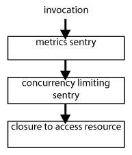

# Chaining sentries

Sentries become even more useful when they are combined. These combinations are called sentry chains. The easiest way to chain sentries is to make use of the builder methods in `SentrySupport`.

Here is a fragment of the introduction example:

```scala
class DoItAllService extends nl.grons.sentries.support.SentrySupport {
  val twitterApiSentry = sentry("twitter").withMetrics.withConcurrencyLimit(3)
}
```

Method `sentry` creates a `SentryBuilder` that keeps track of the owner, the resource name and the default sentry registry.

Sentry builders contain method `withSentry` which ads a sentry _after_ what is currently in the chain. The various other `with_` methods (such as `withMetrics` and `withConcurrencyLimit`) simply forward to the `withSentry` method.

Method `withSentry` composes the current sentry (if there is one) with the given sentry. The combination is both a new sentry and another sentry builder.

## Execution order

Take a look at the following example.

```scala
val twitterApiSentry = sentry("twitter") withMetrics withConcurrencyLimit(3)
  
twitterApiSentry { /* closure to invoke twitter API */ }
```

When `twitterApiSentry` is invoked with a closure, the metrics sentry is executed first. The metrics sentry forwards the closure to the concurrency limiting sentry. The concurrency limiting sentry finally invokes the closure.



## Uniqueness

`SentryBuilder` ensures that each sentry is unique by registering it in a `SentriesRegistry`. Uniqueness is based upon the name of the sentry. The name is build from the owner's class name, the resource name and the sentry type.

When the sentry builder sees an already existing sentry in the registry, the registered sentry will be used instead.

## Advanced chaining

Many remote resources have multiple ways to invoke them. For example, a remote thrift service has multiple methods in its interface. When the service is down, both methods will fail. Therefore it is desirable to have a shared sentry for both methods, for example a circuit breaker. However, it is also useful to have specific sentries for each part. For example because some failures do not correlate, or to add method specific metrics.

Here is an example that demonstrates a shared sentry for a thrift service that exposes 2 methods:

```scala
val sharedTriftSentry = sentry("thrift-all").withMetrics.withFailLimit(25)
val methodASentry = sharedTriftSentry.withSentry(sentry("thrift-a").withTimer)
val methodBSentry = sharedTriftSentry.withSentry(sentry("thrift-b").withTimer)

// False sharing of timer sentry. DON'T DO THIS!
// val methodASentry_wrong = sharedTriftSentry.withTimer
// val methodBSentry_wrong = sharedTriftSentry.withTimer

def methodA(param: String) = methodASentry {
  thriftService.methodA(param)
}

def methodB(param: String) = methodBSentry {
  thriftService.methodB(param)
}
```

Note how the circuit breaker (created in method `withFailLimit`) is shared between the two methods. They are tracked separately by two timer sentries (created in method `withTimer`).
The calls `sentry("thrift-a")` and `sentry("thrift-b")` give the timer sentries a unique resource name (owner and sentry type stay the same). Without this call the sentry builder will use the resource name `"thrift-all"` for both, leading to a shared timer sentry instance for both methods (see also [Uniqueness](#uniqueness) above).
